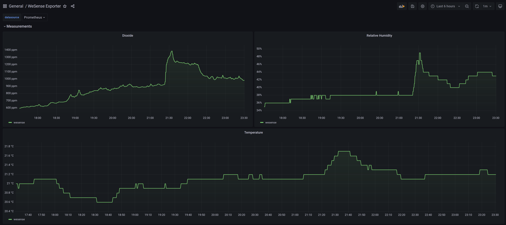

# wesense_exporter

Hey internets! this repo is basically is a toy [OpenTelemetry] project that fetches metrics from the awesome [WeSense] sensor and exposes metrics about dioxide, relative humidity and temperature.

This should be used with a OTel endpoint which can make use of that metric or just use the OpenTelemetry [Collector] and make it export OpenMetrics/Prometheus metrics.



## How to run?

If you got nix you're golden, and no dependencies gathering is necessary. Just make sure you have `direnv` and `nix-direnv` installed and do `direnv allow` to "sleeve into" a dev environment with dependencies installed (see `flake.nix`) when you cd into this repository.

When dependencies are up, verify `.envrc` to make sure configuration is ok. Then simply run:

```bash
just run
```

[WeSense]: https://wesense.tech/
[OpenTelemetry]: https://opentelemetry.io/
[Collector]: https://opentelemetry.io/docs/collector/